# F1 Track Watchface

A Pebble smartwatch watchface featuring 160 real Formula 1 circuit tracks rendered from [f1-circuits-svg](https://github.com/julesr0y/f1-circuits-svg) SVG source data. Cars race around the track following the time, with optional race animations, extra health-data cars, and a full F1 race calendar.

**Platform:** Pebble Emery (228×228)  
**SDK:** Pebble C SDK 4.17

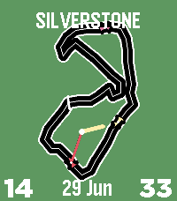

## Features

### Circuit Tracks
- 160 real F1 circuit tracks sourced from [f1-circuits-svg](https://github.com/julesr0y/f1-circuits-svg)
- Tracks are centred and scaled to fit the display using arc-length parameterisation
- Each track has 45 evenly-spaced waypoints sampled from cubic bezier paths
- Tracks auto-detect winding direction and normalise to clockwise

### Time Display
- **Digital modes:** Standard (bottom) and Split Corners (HH | DD MMM | MM)
- **Analog hands:** Optional hour and minute hands drawn to the track
- **Fonts:** Bold 30, Bold 42, Gothic 28 Bold, Leco 36 Bold, Leco 42, Roboto Condensed 21
- **Seconds car:** Sweeps around the track via arc-length progress

### Cars
- **Hour car** (yellow) — positioned by clock angle
- **Minute car** (red) — positioned by minute angle, hand stops at 95% so car is visible
- **Second car** (pink) — arc-length progress from start/finish line
- **Battery car** (purple) — charge level mapped to track position
- **Steps car** (green) — daily step progress
- **Sleep car** (blue) — sleep duration progress
- Extra cars shift sideways when overlapping (overtaking effect)

### Race Animation
- Triggers on the hour change (configurable)
- Hour car laps the track from its current position
- 45 fps smooth animation with 3s per lap
- Random race colours with auto-contrasting text (optional)

### Configuration (via Clay)
- **Track selection:** Follow F1 calendar or choose any of 160 circuits
- **Display:** Time, date, seconds, battery, analog hands
- **Extra cars:** Toggle battery/steps/sleep cars with individual colours
- **Colours:** Background, track, hour, minute, second, text — all configurable
- **Date formats:** DD/MM, DD MMM, MM/DD, MMM DD, Day DD
- **Race name:** Show track name or country name above the circuit
- **Race indicator:** FP (Friday), Q (Saturday), GP (Sunday) during race weekends
- **Invert:** Swap background and text colours
- **Random race colours:** Auto-assign vibrant F1 palette during race animation
- **Reset to defaults:** One-tap reset in config page

### 2026 F1 Calendar
Auto-switches between tracks based on the race schedule:

| Round | Track | Date |
|-------|-------|------|
| 1 | Melbourne | Mar 8 |
| 2 | Shanghai | Mar 15 |
| 3 | Suzuka | Mar 29 |
| 4 | Miami | May 3 |
| 5 | Montreal | May 24 |
| 6 | Monaco | Jun 7 |
| 7 | Barcelona | Jun 14 |
| 8 | Spielberg | Jun 28 |
| 9 | Silverstone | Jul 5 |
| 10 | Spa | Jul 19 |
| 11 | Hungaroring | Jul 26 |
| 12 | Zandvoort | Aug 23 |
| 13 | Monza | Sep 6 |
| 14 | Madrid | Sep 13 |
| 15 | Baku | Sep 26 |
| 16 | Marina Bay | Oct 11 |
| 17 | Austin | Oct 25 |
| 18 | Mexico City | Nov 1 |
| 19 | Interlagos | Nov 8 |
| 20 | Las Vegas | Nov 21 |
| 21 | Lusail | Nov 29 |
| 22 | Yas Marina | Dec 6 |

## Building

### Prerequisites
- [Pebble SDK](https://developer.rebble.io/developer.pebble.com/sdk/index.html) 4.17+
- Node.js (for Clay config)

### Build
```bash
cd f1-track-watchface
pebble build
```

### Install to emulator
```bash
pebble install --emulator emery
```

### Install to watch
Connect your Pebble via Bluetooth, then:
```bash
pebble install
```

### CloudPebble
The project is also compatible with CloudPebble for in-browser development.

## Project Structure

This repo contains just the Pebble app. The full workspace layout:

```
pebble-watchface-agent-skill/
├── f1-circuits-svg/              # SVG source (github.com/julesr0y/f1-circuits-svg)
│   ├── circuits.json             # Metadata for all 160 circuits
│   └── circuits/minimal/black/   # SVG files
├── convert_all.py                # SVG → C waypoint converter
├── f1-circuits-svg-main/         # Converted C arrays
└── f1-track-watchface/           # ← This repo (Pebble app)
    ├── src/
    │   ├── c/
    │   │   └── main.c            # Core watchface (4400+ lines)
    │   └── pkjs/
    │       ├── config.js          # Clay configuration page
    │       └── index.js           # Phone-side JS (calendar, messaging)
    ├── tools/
    │   └── convert_all.py         # SVG → C waypoint converter
    ├── build/                     # Build output (gitignored)
    ├── screenshots/               # Store screenshots and GIFs
    ├── icon_80x80.png             # App icon
    ├── icon_144x144.png           # App icon (large)
    ├── package.json               # Pebble project config + Clay message keys
    ├── wscript                    # Waf build script
    └── README.md
```

## Technical Notes

- **Track geometry:** 45 waypoints per track, sampled at even arc-length intervals from [f1-circuits-svg](https://github.com/julesr0y/f1-circuits-svg) cubic bezier paths via `tools/convert_all.py`
- **Coordinate system:** Internal 100×100 space scaled to 168×168 track area on the 228×228 Emery display
- **Angle-to-track mapping:** Perpendicular-distance crossing detection with dot product direction filtering — handles non-convex tracks correctly
- **Race animation:** `app_timer` at 45 fps using `time_ms()` for sub-second precision
- **Health data:** Uses `health_service_sum()` with explicit time range from midnight
- **Settings persistence:** All settings stored via `persist_read_int`/`persist_write_int` with AppMessage updates from Clay config

## Screenshots

All 22 calendar tracks with unique background colours:

| Melbourne | Shanghai | Suzuka | Miami |
|-----------|----------|--------|-------|
| 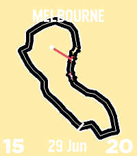 | 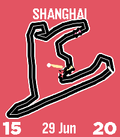 | 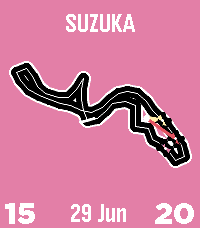 | 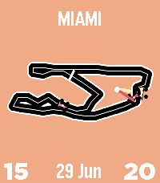 |

| Monaco | Barcelona | Silverstone | Spa |
|--------|-----------|-------------|-----|
| 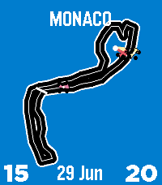 | 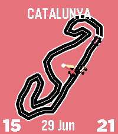 | 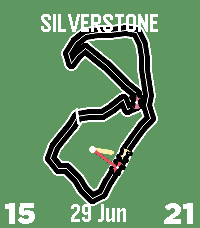 | 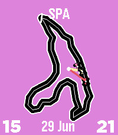 |

| Monza | Madrid | Baku | Marina Bay |
|-------|--------|------|------------|
| 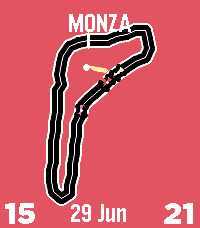 | 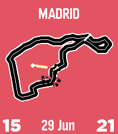 | 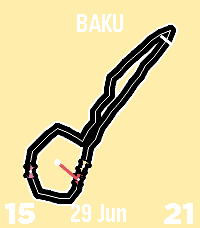 | 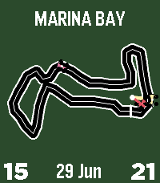 |

| Austin | Mexico City | Interlagos | Las Vegas |
|--------|-------------|------------|-----------|
| 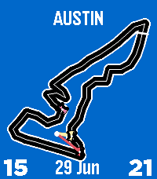 | 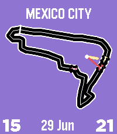 | 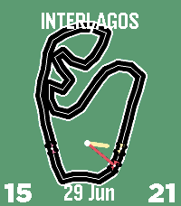 | 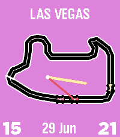 |

## Circuit Data

Track geometries are derived from [f1-circuits-svg](https://github.com/julesr0y/f1-circuits-svg) by Jules Roy. The SVG paths from that repository are converted to 45-point waypoint arrays using a batch converter (`convert_all.py` in the parent repo).

The converter lives alongside the SVG source at:
```
../f1-circuits-svg/          # SVG source (git submodule or sibling repo)
../f1-circuits-svg/circuits.json
../f1-circuits-svg/circuits/minimal/black/*.svg
../convert_all.py             # SVG → C waypoint converter
```
### SVG to C Converter

The `tools/convert_all.py` script converts SVG circuit paths from [f1-circuits-svg](https://github.com/julesr0y/f1-circuits-svg) into C waypoint arrays used by the watchface.

**Setup:**
```bash
# Clone the SVG source as a sibling directory
cd ..
git clone https://github.com/julesr0y/f1-circuits-svg.git
cd f1-track-watchface
```

**Usage:**
```bash
# Default paths (expects f1-circuits-svg in parent directory)
python3 tools/convert_all.py

# Custom paths
python3 tools/convert_all.py --svg-dir /path/to/svg/files --output-dir src/c
```

**Output:**
- `src/c/circuit_arrays.h` — waypoint arrays (`static const GPoint c_<key>[]`)
- `src/c/circuit_entries.h` — table entries to paste into `s_circuits[]` in `main.c`

**How it works:**
1. Parses SVG `<path>` elements (supports `M`, `C`, `S`, `L`, `A`, `Z` commands)
2. Densifies cubic bezier curves to 50 points per segment
3. Computes cumulative arc length and samples 45 evenly-spaced waypoints
4. Scales to 0–80 coordinate space and shifts centroid to (50, 50)
5. Finds the deepest interior point (centre of largest inscribed circle) for the track centre
6. Outputs GPoint arrays and `CIRCUIT()` macro entries


## Acknowledgements

- [f1-circuits-svg](https://github.com/julesr0y/f1-circuits-svg) by Jules Roy — SVG source data for all 160 circuit tracks
- [Pebble SDK](https://developer.rebble.io/developer.pebble.com/sdk/index.html) — watchface development platform
- [Clay](https://github.com/nicola-pebble/pebble-clay) — configuration page framework

## License

MIT
